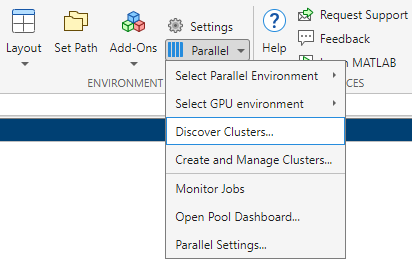
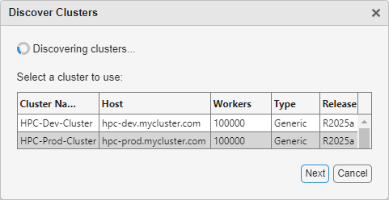
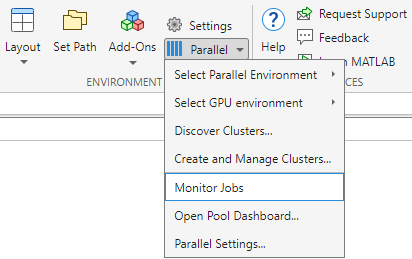
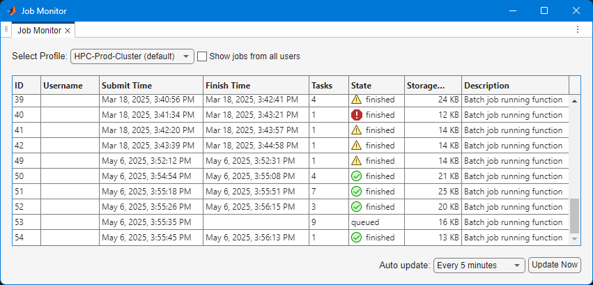

# <span style="color:rgb(213,80,0)">Parallel Computing with MATLAB on the Snellius HPC Cluster</span>

This document provides the steps to configure MATLAB to submit jobs to a cluster, retrieve results, and debug errors.

# Initial Configuration \- Running MATLAB on the HPC Cluster

This setup is intended for job submission when you are logged directly into the cluster, either through a command\-line or graphical interface.  This process needs to be done once per cluster.


After logging into the cluster, start MATLAB.  On the Home tab, click `Parallel > Discover Clusters…` to discover the profile.

<p style="text-align:left">
   
</p>


<p style="text-align:left">
   
</p>


Follow the prompts to create a new cluster profile.  Jobs will run across multiple nodes on the cluster rather than on the host machine.

# Initial Configuration \- Running MATLAB on the Desktop

This setup is intended for job submission when MATLAB is installed on your machine and jobs are run remotely on the cluster.  This setup needs to be done once per cluster, per version of MATLAB installed on your machine.


Start MATLAB and run `userpath`

```matlab
userpath
```

Download the MATLAB plugin scripts from [here](https://github.com/sara-nl/matlab-parallel-server/blob/main/surf.Desktop.zip).  The contents of the ZIP file should be extracted into the folder returned by the call to `userpath`.


Create a new cluster profile

```matlab
configCluster
```

Submission to the cluster requires SSH credentials. You will be prompted for username and password or identity file (private key) when submitting your first job. The username and location of the private key will be stored in MATLAB for future sessions.


Jobs will now run on the cluster rather than on the local machine.


**NOTE**: To run jobs on the local machine instead of the cluster, use the `Processes` profile.

```matlab
% Get a handle to the local resources
c = parcluster('Processes');
```
# Configuring Jobs

Prior to submitting the job, various scheduler flags can be assigned, such as queue, e\-mail, walltime, etc.


First, the authentication mode needs to be configured. When you create the parcluster object the first time, you will be prompted for the authentication method.  Specify the method accordingly. If you use the traditional username / password authentication, select 1.  If you use public key authentication, select 2.  If you use Two\-factor authentication on Snellius, select 3.

```matlab
% Get a handle to the cluster
c = parcluster;
    [1] Password
    [2] IdentityFile
    [3] IdentityFile and OTP
    [4] Other
    [5] Cancel
```

In case of 2 or 3, the location of your private key needs to be specified:

```matlab
c.AdditionalProperties.IdentityFile = '/path/to/your/.ssh/private/key'
c.saveProfile
```

The following is a partial list of parameters.  See AdditionalProperties for the complete list.  Only *Partition* and *WallTime* is required on Snellius.

```matlab
% Get a handle to the cluster
c = parcluster;

% REQUIRED

% Specify the partition
c.AdditionalProperties.Partition = 'partition-name';

% Specify the wall time (e.g., 1 day, 5 hours, 30 minutes)
c.AdditionalProperties.WallTime = '1-05:30';

% OPTIONAL

% Specify an account
c.AdditionalProperties.AccountName = 'account-name';

% Specify a constraint
c.AdditionalProperties.Constraint = 'feature-name';

% Request email notification of job status
c.AdditionalProperties.EmailAddress = 'user-id@university-name.nl';

% Specify number of GPUs (default: 0)
c.AdditionalProperties.GPUsPerNode = 1;

% Specify a particular GPU card
c.AdditionalProperties.GPUCard = 'gpu-card';

% Specify memory to use, per core (default: 4GB)
c.AdditionalProperties.MemPerCPU = '6GB';

% Specify cores per node
c.AdditionalProperties.ProcsPerNode = 4;

% Set node exclusivity (default: false)
c.AdditionalProperties.RequireExclusiveNode = true;

% Specify a reservation
c.AdditionalProperties.Reservation = 'reservation-name';

```

To persist changes made to `AdditionalProperties` between MATLAB sessions, save the profile

```matlab
c.saveProfile
```

 To see the values of the current configuration options, display `AdditionalProperties`.

```matlab
c.AdditionalProperties
```

 Unset a value when no longer needed.

```matlab
% Turn off email notifications
c.AdditionalProperties.EmailAddress = '';

% Don't request an entire node
c.AdditionalProperties.RequireExclusiveNode = false;
```
# Interactive Job \- Running MATLAB on the HPC Cluster

To run an interactive pool job on the cluster, continue to use `parpool` as before.

```matlab
% Get a handle to the cluster
c = parcluster;

% Open a pool of 64 workers on the cluster
pool = c.parpool(64);
```

 Rather than running a local pool on the host machine, the pool can now run across multiple nodes on the cluster.

```matlab
% Run a parfor over 1000 iterations
parfor idx = 1:1000
    a(idx) = rand;
end
```

 Delete the pool when it’s no longer needed.

```matlab
% Delete the pool
pool.delete
```
# Independent Batch Job \- MATLAB on the HPC Cluster or Desktop

Use the `batch` command to submit asynchronous jobs to the cluster. The `batch` command will return a job object which is used to access the output of the submitted job. See the MATLAB documentation for more help on [`batch`](https://www.mathworks.com/help/parallel-computing/batch.html).

```matlab
% Get a handle to the cluster
c = parcluster;

% Submit job to query where MATLAB is running on the cluster
job = c.batch(@pwd, 1, {}, 'CurrentFolder', '.');

% Query job for state
job.State

% If job is finished, fetch the results
job.fetchOutputs{1}

% Delete the job after results are no longer needed
job.delete
```

To retrieve a list of running or completed jobs, call `parcluster` to return the cluster object. The cluster object stores an array of jobs that are listed as *queued*, *running*, *finished*, or *failed*. Retrieve and view the list of jobs as shown below.

```matlab
c = parcluster;
jobs = c.Jobs

% Get a handle to the second job in the list
job2 = c.Jobs(2);
```

Once the job has been selected, fetch the results as previously done.


`fetchOutputs` is used to retrieve function output arguments; if calling `batch` with a script, use `load` instead. Data that has been written to disk on the cluster needs to be retrieved directly from the file system (e.g., via sftp).

```matlab
% Fetch all results from the second job in the list
job2.fetchOutputs{:}

% Alternate: Load results if job was a script instead of a function
job2.load
```
# Parallel Batch Job \- MATLAB on the HPC Cluster or Desktop

The `batch` command can also support parallel workflows. Let’s use the following example for a parallel job, which you should save separately as `parallel_example.m`.

```matlab
function [sim_t, A] = parallel_example(iter)

if nargin==0
    iter = 8;
end

disp('Start sim')

A = nan(iter,1);
t0 = tic;
parfor idx = 1:iter
    A(idx) = idx;
    pause(2)
    idx
end
sim_t = toc(t0);

disp('Sim completed')

save RESULTS A

end
```

This time when using the `batch` command, specify a Pool argument.

```matlab
% Get a handle to the cluster
c = parcluster;

% Submit a batch pool job using 4 workers for 16 simulations
job = c.batch(@parallel_example, 1, {16}, 'CurrentFolder','.', 'Pool', 4);

% View current job status
job.State

% Fetch the results after a finished state is retrieved
job.fetchOutputs{1}
ans =
    8.8872
```

The job ran in 8.89 seconds using four workers. Note that these jobs will always request `N+1` CPU cores, since one worker is required to manage the batch job and pool of workers. For example, a job that needs eight workers will require nine CPU cores.


Run the same simulation again but increase the Pool size. This time, to retrieve the results later, keep track of the job ID.


**NOTE**: For some applications, there will be a diminishing return when allocating too many workers, as the overhead may exceed computation time.

```matlab
% Get a handle to the cluster
c = parcluster;

% Submit a batch pool job using 8 workers for 16 simulations
job = c.batch(@parallel_example, 1, {16}, 'CurrentFolder','.', 'Pool', 8);

% Get the job ID
id = job.ID
id =
    4

% Clear job from workspace (as though MATLAB exited)
clear job
```

With a handle to the cluster, the `findJob` method searches for the job with the specified job ID.

```matlab
% Get a handle to the cluster
c = parcluster;

% Find the old job
job = c.findJob('ID', 4);

% Retrieve the state of the job
job.State
ans =
    finished

% Fetch the results
job.fetchOutputs{1};
ans =
    4.7270
```

The job now runs in 4.73 seconds using eight workers. Run code with different numbers of workers to determine the ideal number to use.


Alternatively, to retrieve job results via a graphical user interface, use the Job Monitor (`Parallel > Monitor Jobs`).

<p style="text-align:left">
   
</p>


<p style="text-align:left">
   
</p>

# Debugging

If a serial job produces an error, call the `getDebugLog` method to view the error log file.


When submitting an independent job, specify the task.

```matlab
c.getDebugLog(job.Tasks)
```

For Pool jobs, only specify the job object.

```matlab
c.getDebugLog(job)
```

When troubleshooting a job, the cluster admin may request the scheduler ID of the job. This can be derived by calling `getTaskSchedulerIDs` (call `schedID(job)` before R2019b).

```matlab
job.getTaskSchedulerIDs()
ans =
    25539
```
# Helper Functions
| Function <br>  | Description <br>  | Notes <br>   |
| :-- | :-- | :-- |
| clusterFeatures <br>  | Lists cluster features/constraints <br>  |   |
| clusterGpuCards <br>  | Lists cluster GPU cards <br>  |   |
| clusterPartitionNames <br>  | Lists cluster partition names <br>  |   |
| disableArchiving <br>  | Modifies file archiving to resolve file mirroring issues <br>  | Applicable only to Desktop <br>   |
| fixConnection <br>  | Reestablishes cluster connection (e.g., after reconnection of VPN) <br>  | Applicable only to Desktop <br>   |
| seff <br>  | Displays Slurm statistics related to the efficiency of resource usage by the job <br>  |   |
| willRun <br>  | Explains why job is queued <br>  |   |

# To Learn More

To learn more about the MATLAB Parallel Computing Toolbox, check out these resources:

-  [Parallel Computing Overview](http://www.mathworks.com/products/parallel-computing/index.html) 
-  [Parallel Computing Documentation](http://www.mathworks.com/help/distcomp/index.html) 
-  [Parallel Computing Coding Examples](https://www.mathworks.com/help/parallel-computing/examples.html) 
-  [Parallel Computing Tutorials](http://www.mathworks.com/products/parallel-computing/tutorials.html) 
-  [Parallel Computing Videos](http://www.mathworks.com/products/parallel-computing/videos.html) 
-  [Parallel Computing Webinars](http://www.mathworks.com/products/parallel-computing/webinars.html) 
